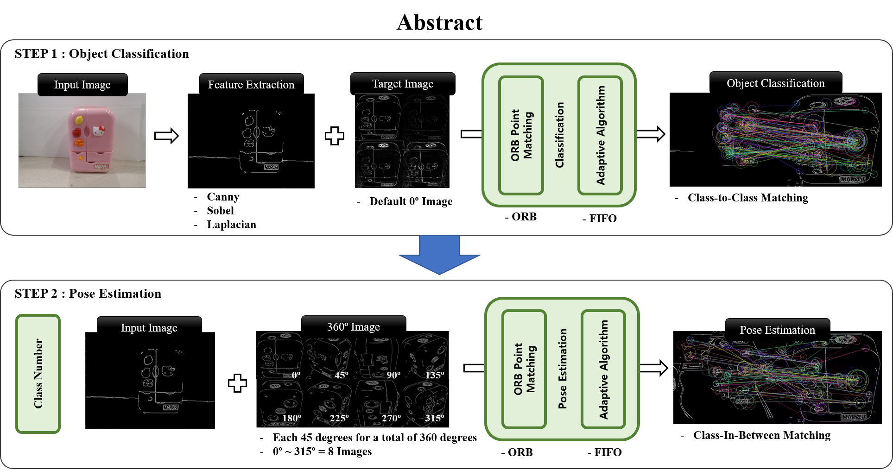
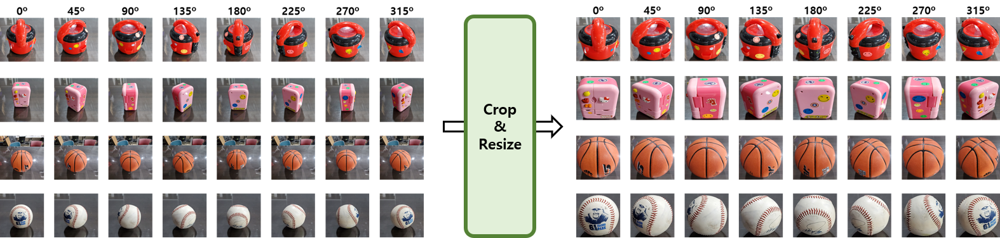
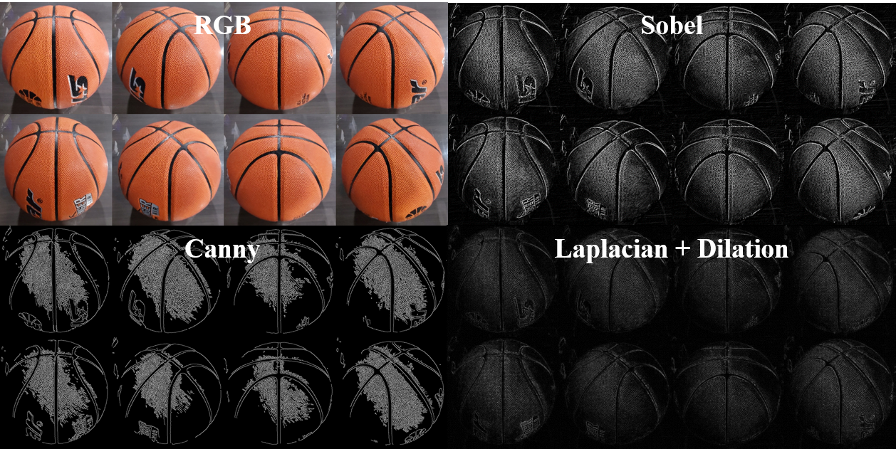
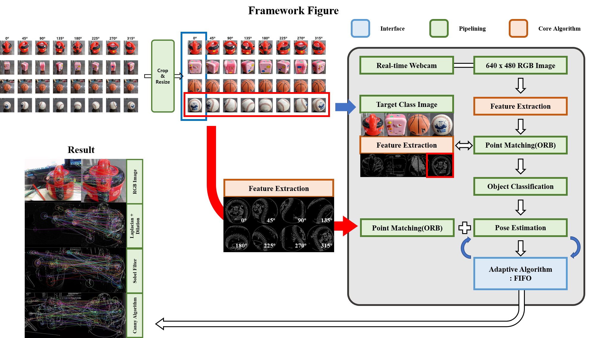
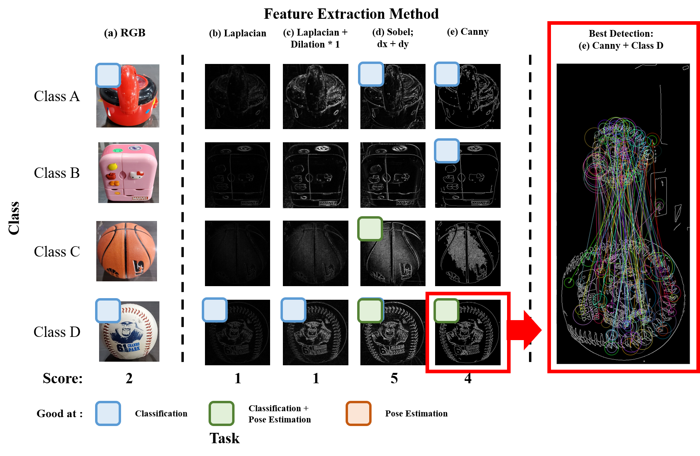

# Point_Matching_ORB

Real-time Adaptive Point Matching using ORB according to Feature Extraction Method

## Abstract

## Datset

## Feature Extraction Method

## Classification
### RGB

### Canny

### Sobel

### Laplacian + Dilation

## Pose Estimation
### RGB

### Canny

### Sobel

## Framework

## Experiment

## Failure Case - Pose Estimation

