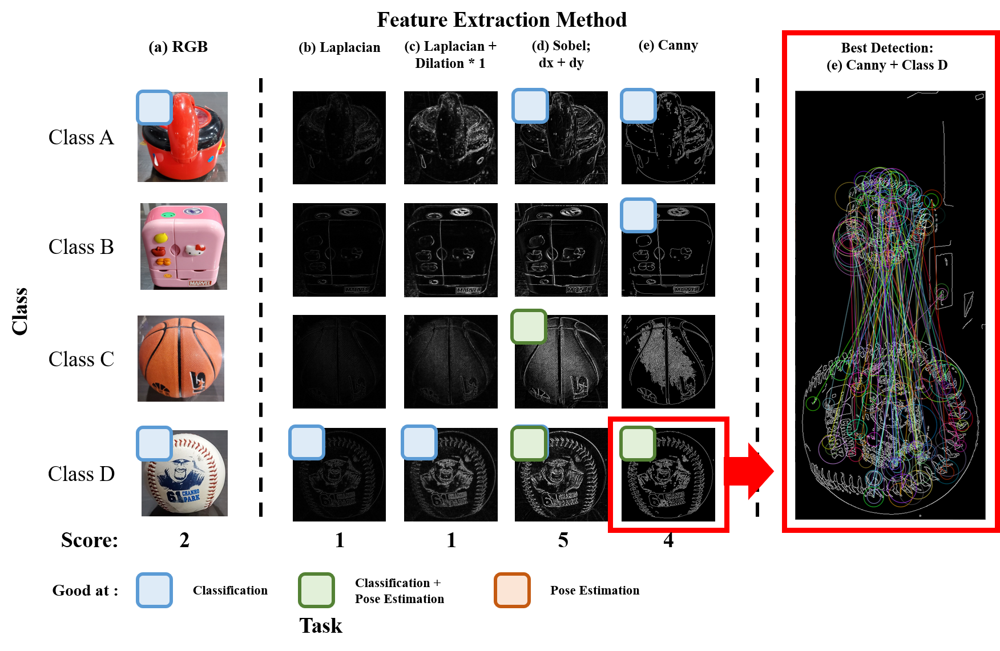
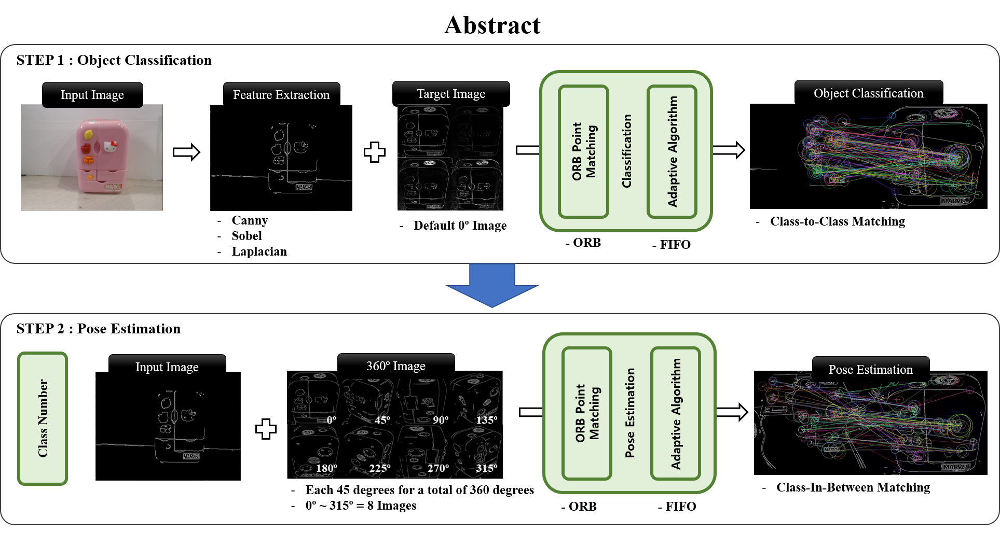
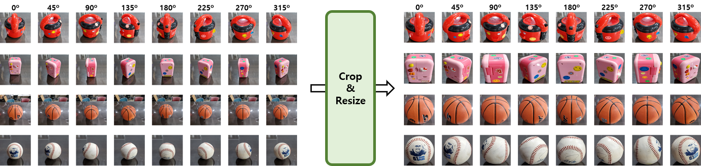
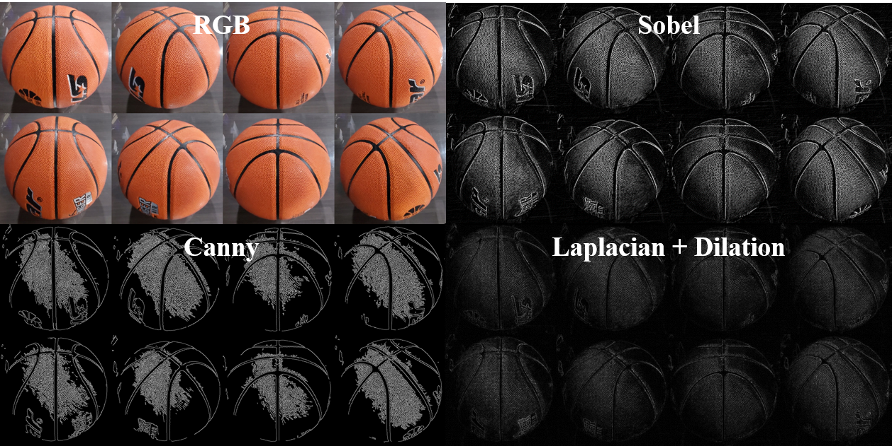
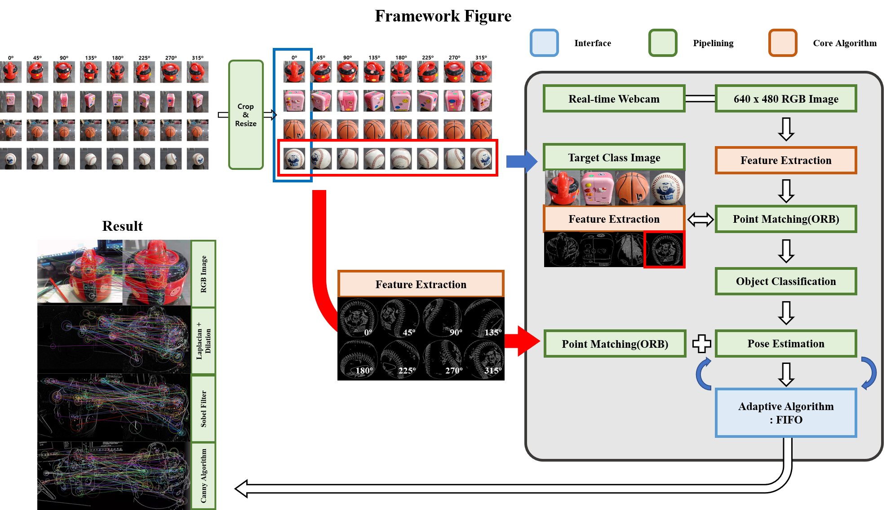

# Object Pose Estimation using ORB Algorithm

Paper : **Object Pose Estimation based on ORB Algorithm according to Feature Extraction Method, KISM2021-Fall**  

## Abstract

## Datset

## Feature Extraction Method

## Classification
### RGB / Canny / Sobel / Laplacian+Dilation

  
   
  
  

## Pose Estimation
### RGB / Canny / Sobel 

  
  
  

## Framework

## Failure Case - Pose Estimation

